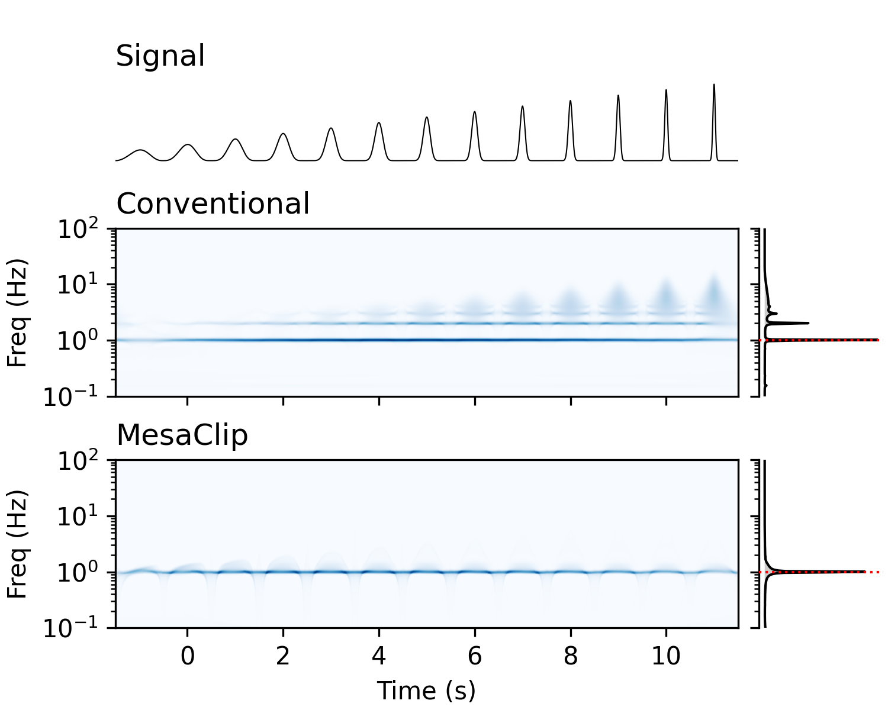
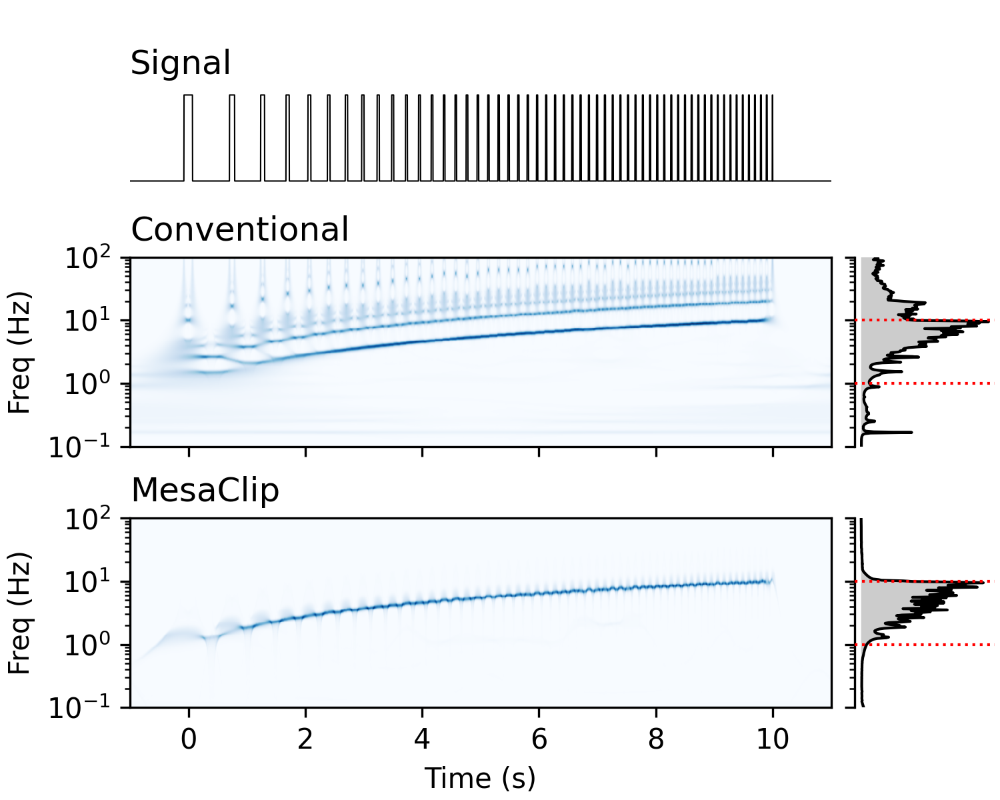

An O(n) algorithm for clipping wide peaks from 1D signals, designed for application to removing harminc artefacts from the continuous wavelet transform.

Published in the open-access article: https://www.frontiersin.org/articles/10.3389/fphys.2020.00484/full

Given a signal with amplitudes `y[0..n-1]` and non-decreasing locations `x[0..n-1]`,
clips all peaks that are too wide `x[b] - x[a] > k` for all `b > a` and given parameter `k`.

The following animation shows an example with a uniformally increasing `x` along the horizontal, `y` along the vertical, and `k = 12`:

The `mesaclip.py` file contains the main algorithm in the `mesaclip` function, and `demo.py` will reproduce the animation.
Running the `mesaclip.py` file will run tests on random signals.

The following table shows four examples comparing a convential continuous wavelet transform and one with mesaclipping applied.
The middle subplots use a conventional Morse(&beta;=12, &gamma;=3) wavelet transform, and the bottom subplots use a Morse(&beta;=1.58174, &gamma;=3) wavelet with mesaclipping applied. The mesaclipped version does not suffer from harmonic artefacts generated due to sharp changes in the singals.

| | |
:---:|:---:
From a smooth to a spiky signal  | Bursts of Dirac deltas 
Thresholded chirp                | Real EMG signal        

The choice of &beta;=1.58174 is based on minimising the 1st harmonic amplitude of a Dirac comb halfway between two Dirac delta functions:

Example applications to some real EMG data:

Exploration of signal-to-noise ratio for artificial spike-train signals of varying regularity:

Estimates of the ground truth frequency:

